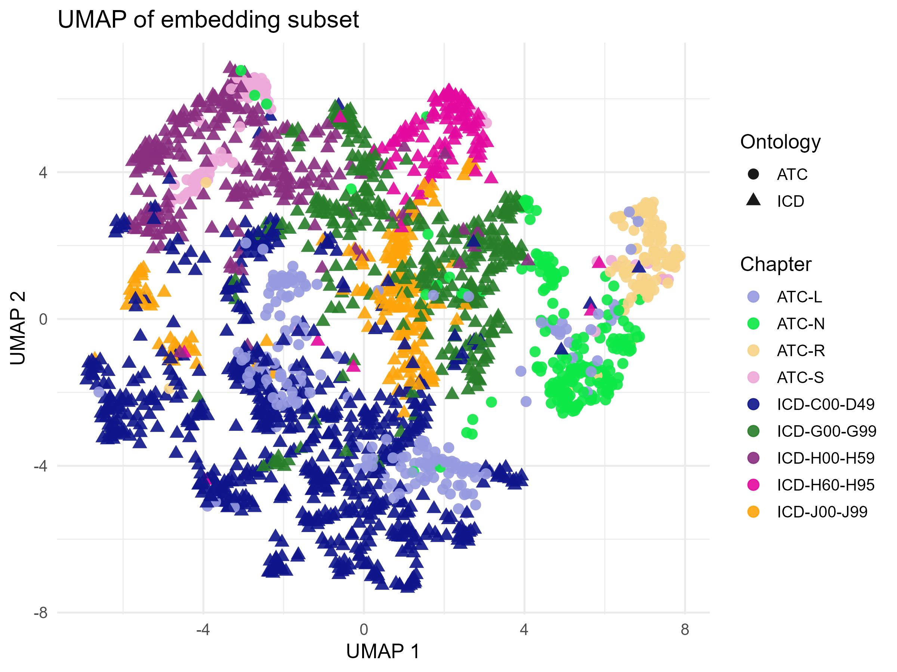
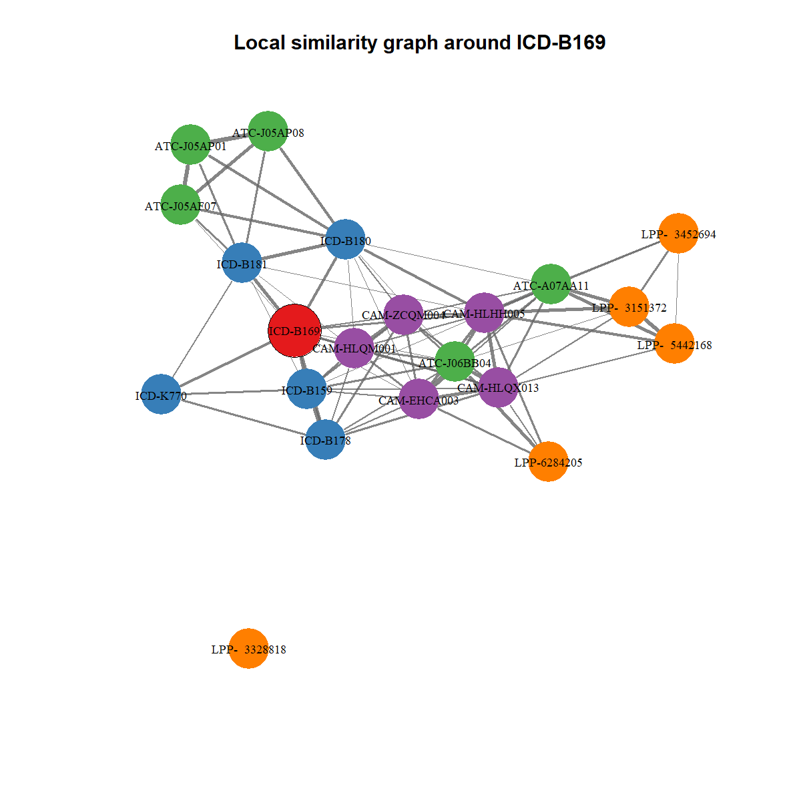

# Main results: released embeddings and exploration scripts

This folder contains the **released ICD–ATC embedding space** learned from ESND claims data,
together with a **minimal set of scripts** for exploring their semantic structure.

The goals are to:
- share the embeddings used in the accompanying paper,
- provide simple and transparent examples for neighbourhood queries and latent-space visualisation.

---

## Contents

```
main_results/
├── README.md
├── data/
│ ├── embeddings_ESND_2FC.csv.gz
│ ├── vocab.csv
│ ├── label_table.csv
│ ├── chapter_table.csv
│ ├── umap_chapter_subset.png
│ └── local_graph_ICD-B169.png
│
├── 01_neighbour_retrieval.R
├── 02_umap_graph.R
│
└── functions/
├── similarity_measures.R
└── get_label.R 
```
---

All scripts are intended to be run **from the repository root** and rely on **relative paths**.

---

## Data

### `embeddings_ESND_2FC.csv.gz`
Final static embeddings for:
- **ICD-10** diagnosis codes,
- **ATC** medication codes.

The embedding space also includes major coding systems used in the French SNDS:
procedures (**CCAM**), medical devices (**LPP**), and laboratory tests (**NABM**).

- Rows correspond to medical codes
- Columns correspond to embedding dimensions
- Code identities are provided via `vocab.csv`

### `vocab.csv`
Mapping between embedding row indices and medical code identifiers.

### `label_table.csv`
Human-readable labels for codes, used for interpretation and visualisation.

### `chapter_table.csv`
High-level chapter or group assignments used for colouring UMAP projections.

---

## Scripts

### `01_neighbour_retrieval.R` — Nearest-neighbour queries

Helper script to retrieve the **nearest neighbours of a target medical code**
using cosine similarity in the embedding space.

The search can be restricted to a specific coding system using **code prefixes**:
`ICD`, `ATC`, `CAM`, `LPP`, `BIO`.

**Typical uses**
- Inspect semantic neighbourhoods of diagnoses or medications.
- Explore diagnosis–treatment associations captured by the embeddings.
- Perform quick sanity checks of embedding coherence.

**Usage**
- Edit the example parameters at the bottom of the script
  (`target_code`, `ontology`, `k`).
- Run the script from the **repository root**.

The script prints a preview table and returns a `data.frame` of neighbours.

---

### `02_umap_graph.R` — UMAP and local graph visualisation

Script for **visual exploration of the embedding space**, reproducing the two main exploratory analyses used in the paper:

- **2D UMAP projection** of a user-defined subset of medical codes  
  (points = codes, colour = chapter/group, shape = ontology prefix).

- **Local similarity graph** around a target code  
  showing its closest neighbours across selected coding systems.

The script is intended as a **hands-on template**:
users are encouraged to edit the code subset, target code, and parameters
to explore different regions of the embedding space.

UMAP parameters, code filtering, and colour palette match those used in the paper.

The script saves:
- a UMAP projection (`umap_chapter_subset.png`),
- a local similarity graph around the selected target code
  (`local_graph_<CODE>.png`),

both written to `main_results/data/`.

---
## Example outputs

<table align="center">
  <tr>
    <td align="center">
      <br/>
      <em>UMAP projection</em>
    </td>
    <td align="center">
      <br/>
      <em>Local similarity graph</em>
    </td>
  </tr>
</table>